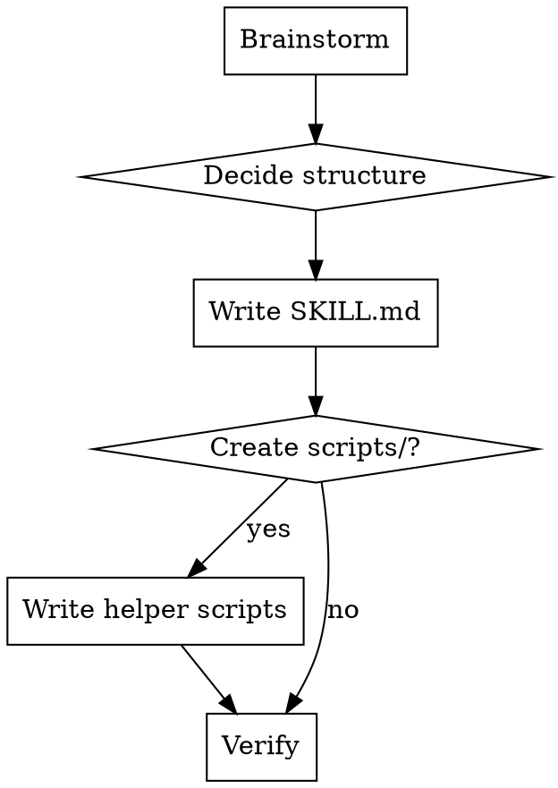

# Create Skill

Guide for creating new skills. Brainstorm with the user, then generate a well-structured skill directory with proper frontmatter, `{{SKILLS_DIR}}` usage, and optional helper scripts.

## Process



## Step 1: Brainstorm

Ask the user these questions **one at a time** using `AskUserQuestion`. Skip any the user already answered.

### Required Questions

1. **Purpose** — "What should this skill do?" (open-ended)
2. **Name** — Suggest a kebab-case name based on their answer. Verb-first, active voice (`create-widget` not `widget-creation`).
3. **Invocation type** — "Should this be user-invocable (called with `/skill-name`) or model-invocable (triggered automatically by context)?"
4. **Tools needed** — "What tools does this skill need?" Common sets:
   - Read-only: `Bash, Read, Glob, Grep`
   - File creation: `Bash, Read, Write, Edit, Glob, Grep`
   - Interactive: add `AskUserQuestion`
   - Full: `Bash, Read, Write, Edit, Glob, Grep, AskUserQuestion, Task`

### Situational Questions

Ask these only when relevant:

- **Helper scripts** — "Does this need bash helper scripts, or is the SKILL.md body sufficient?" Ask when the skill involves running commands or complex logic.
- **Model** — Default to `haiku` for simple/scripted skills, `sonnet` for skills needing reasoning. Only ask if unclear.
- **Arguments** — "Does this skill take arguments?" If yes, ask for the `argument-hint` format. Only relevant for user-invocable skills.
- **Context** — Default to `fork` (isolated). Use `conversation` only if the skill needs access to the current conversation context.

## Step 2: Directory Structure

Create under the target skills directory:

```
skills/{name}/
  SKILL.md              # Required
  scripts/              # Optional
    {name}.sh           # Helper script(s)
```

Skills must be **self-contained directories**. Everything the skill needs lives inside its directory.

## Step 3: Write SKILL.md

### Frontmatter Reference

```yaml
---
name: skill-name                    # kebab-case, letters/numbers/hyphens only
description: Use when [triggers]... # Start with "Use when", describe WHEN not WHAT
disable-model-invocation: false     # true = only user can invoke
user-invocable: true                # true = shows as /skill-name command
context: fork                       # fork (isolated) or conversation (in-context)
model: haiku                        # haiku | sonnet | opus
allowed-tools: Bash, Read           # comma-separated tool list
argument-hint: "[arg] (default: x)" # optional, for user-invocable skills
---
```

### Frontmatter Rules

- **`description`**: Describe WHEN to use, not WHAT it does. Start with "Use when...". Write in third person. Never summarize the workflow — agents may shortcut to the description and skip the body.
- **`name`**: Letters, numbers, hyphens only. No special characters.
- **`model`**: `haiku` for scripted/simple skills. `sonnet` for reasoning-heavy skills. `opus` rarely needed.
- **`allowed-tools`**: Only list tools the skill actually uses.

### Body Structure

```markdown
# Skill Title

One-line summary of what this does.

## Instructions

Numbered steps the agent follows.
Reference scripts with: {{SKILLS_DIR}}/{name}/scripts/{script}.sh

## [Additional Sections as Needed]

Keep concise. Agents have limited context.
```

### Writing Guidelines

- **Be concise.** Target <200 words for frequently-loaded skills, <500 words otherwise.
- **Use `{{SKILLS_DIR}}`** for all script/file references. This token is replaced at install time with the resolved path (e.g., `~/.claude/skills` or `./.cursor/skills`).
- **One good example > many mediocre ones.** Don't repeat patterns across languages.
- **Flowcharts only for non-obvious decisions.** Use numbered lists for linear steps.
- **No narrative storytelling.** Skills are references, not journals.

## Step 4: Helper Scripts

If the skill needs scripts, create them in `scripts/` inside the skill directory.

### Script Conventions

```bash
#!/usr/bin/env bash
set -euo pipefail

# Script logic here
```

- Start with `set -euo pipefail`
- Scripts can also use `{{SKILLS_DIR}}` to reference other files
- Use embedded `python3` for complex data processing (JSON parsing, etc.)
- Keep scripts self-contained — don't depend on external tools beyond standard unix + python3

### Referencing Scripts from SKILL.md

```markdown
1. Run the script:
   ```
   bash {{SKILLS_DIR}}/{name}/scripts/{name}.sh $ARGUMENTS
   ```
```

## Step 5: Verify

After generating the skill files:

1. **Check frontmatter** — all required fields present, description starts with "Use when"
2. **Check `{{SKILLS_DIR}}`** — used everywhere a path references the skill directory (never hardcode paths)
3. **Check structure** — SKILL.md exists, scripts/ has executable `.sh` files if needed
4. **Read it back** — read the generated files and confirm they look correct
5. **Tell the user** — remind them to run `install.sh` to deploy the skill to their target

## Quick Reference

| Decision | Default | Override When |
|----------|---------|---------------|
| Model | `haiku` | Skill needs reasoning → `sonnet` |
| Context | `fork` | Needs conversation history → `conversation` |
| User-invocable | Ask user | — |
| Scripts dir | Skip | Skill runs bash commands |
| argument-hint | Skip | User-invocable + takes args |
